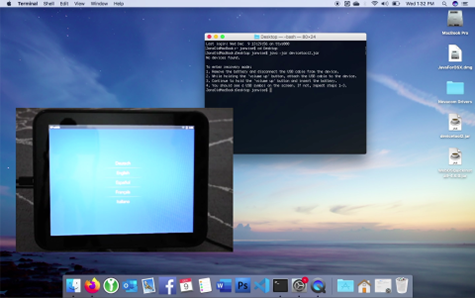

# Activating a webOS Device

The Palm/HP activation services have been down a long time, but that doesn't mean your beautiful phone or tablet are dead! With a little effort, you can use the tools HP left behind to activate your device...

---
> **_NOTE:_** If you've done this before and just want the files, <a href="http://www.webosarchive.org/activation" target="_blank">download here</a>.

---

*For Touchpads that won't turn on at all, community member [M.A.Touchpad has written a restoration guide](tprestore.md) that you may find useful.*

## Prepare Your Computer

This process works on Mac, Linux and Windows, but requires Java to be installed:

* Install Java (JDK) for Windows: <a href="https://www.oracle.com/java/technologies/downloads/" target="_blank">https://www.oracle.com/java/technologies/downloads/</a>
* Install Java for Mac: <a href="https://support.apple.com/en-us/HT204036" target="_blank">https://support.apple.com/en-us/HT204036</a>
* Install Java for Linux: <a href="https://www.fosstechnix.com/install-oracle-java-8-on-ubuntu-20-04/" target="_blank">https://www.fosstechnix.com/install-oracle-java-8-on-ubuntu-20-04/</a>

Next you will need the Novacomm driver for your computer:

* Windows 32-bit (Tested on Windows 7): [Installer MSI](http://www.webosarchive.org/activation/drivers/novacom-win-32/)
* Windows 64-bit (Tested on Windows 10): [Installer MSI](http://www.webosarchive.org/activation/drivers/novacom-win-64/)
* macOS 32-bit (Tested up to Mojave): [Installer PKG](http://www.webosarchive.org/activation/drivers/novacom-mac/)
* macOS 64-bit (For Catalina and Later): <a href="https://github.com/incidentist/novacomd/releases/tag/macos64" target="_blank">GitHub Release</a>
* Linux 32-bit (Tested on Ubunutu): [DEB Package](http://www.webosarchive.org/activation/drivers/novacom-linux-32/)
* Linux 64-bit (Tested on Ubunutu): [DEB Package](http://www.webosarchive.org/activation/drivers/novacom-linux-64/)

Make sure you have a good quality micro USB cable connected directly to your computer (not to a hub.) The OEM cables are your best bet (they're recognizable by a silver indented circle near USB connectors.)

## Download the Tool

* [devicetool](http://www.webosarchive.org/activation/devicetool/devicetool.jar) For webOS 1.x Devices (Pre, Pixi, Pre Plus)
* [devicetool2](http://www.webosarchive.org/activation/devicetool/devicetool2.jar) For webOS 2.x and 3.x Devices (Pre 2, Pre3, Veer and TouchPad)
* [devicetool All-in-One](http://www.webosarchive.org/activation/devicetool/devicetoolAIO.jar) Community created all-in-one, works all of the above, plus TouchPad Go

## Prepare Your Device

Reboot your device into recovery mode...

### Phones (except Veer)

* Plug the USB cable into your computer. Do not connect the other end to your device yet.
* Remove the battery from the device.
* Hold down the device's volume up button.
* Insert the USB cable into the device.
* Re-insert the battery.
* Release the volume up button.

### TouchPad and Veer

* Reboot the device
    + On TouchPad, hold the home and power buttons to force a reboot -- keep holding
    + On Veer, power down completely. Wait a few seconds with no buttons pressed, then press and keep holding the power button to power back on
* As soon as the device restarts, let go of the Power (and Home, on TouchPad) and hold the Volume Up button
* Keep holding the Volume Up button until you see the USB symbol

## Run the Activation Tool

You'll need a command line in your operating system of choice. On a Mac or Ubuntu, this is called Terminal. On Windows, press the Windows key and type "command" and hit enter.

* Using your command line, navigate to the directory where you downloaded the Doctor tool.
* Run the command for the tool you downloaded: 
    + webOS 1.x: `java -jar devicetool.jar`
    + webOS 2+: `java -jar devicetool2.jar`
    + All-in-One: `java -jar devicetoolAIO.jar`
* Wait while the device is updated and rebooted

## Join WiFi

Once the device restarts, it will have bypassed activation, and you're ready to begin using it. 
Use the built-in settings to join your WiFi -- webOS works with 2.4ghz WiFi networks and all common wireless security schemes, including WPA.

## Video Tutorial

A video showing activation and [app installation](appstores.md) is available on YouTube...

## What Next

Now that you've activated your device, you might want to [install some apps](appstores.md)!

## Alternate Instructions

This documentation attempts to update and simplify information available from older, archived sources. You may find that material to be useful as reference:

* <a href="https://www.webosnation.com/bypass-activation-webos-1-x" target="_blank">WebOS Nation Bypass Activation webOS 1.0</a>
* <a href="https://www.webosnation.com/bypass-activation-webos-2-x" target="_blank">WebOS Nation Bypass Activation webOS 2.0</a>
* <a href="https://h30434.www3.hp.com/t5/Tablets-and-Mobile-Devices-Archive-Read-Only/How-to-use-the-webOS-Doctor-on-the-TouchPad/td-p/2186473" target="_blank">Archived HP Forum Post</a>