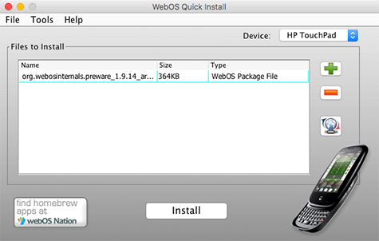
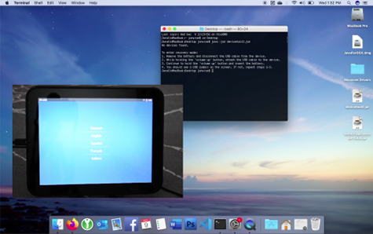

# Installing Apps on your webOS Device

There's a vibrant community rescuing, archiving, restoring and even building apps for webOS. Since the actual HP App Catalog is gone, you'll need your computer one more time to "side-load" one app that gives you access to the rest of this "after-life" ecosystem.

## Prepare Your Computer

This tool works on Mac, Linux and Windows, and requires Java and the devices drivers to be installed. If you've completed the [activation process documented here](activate.md), you can skip this step, because you've already installed these pieces:

* Install Java (JDK) for Windows: <a href="https://www.oracle.com/java/technologies/downloads/" target="_blank">https://www.oracle.com/java/technologies/downloads/</a>
* Install Java for Mac: <a href="https://support.apple.com/en-us/HT204036" target="_blank">https://support.apple.com/en-us/HT204036</a>
* Install Java for Linux: <a href="https://www.fosstechnix.com/install-oracle-java-8-on-ubuntu-20-04/" target="_blank">https://www.fosstechnix.com/install-oracle-java-8-on-ubuntu-20-04/</a>

Next you will need the Novacomm driver for your computer:

* Windows 32-bit (Tested on Windows 7): [Installer MSI](http://www.webosarchive.com/activation/drivers/novacom-win-32/)
* Windows 64-bit (Tested on Windows 10): [Installer MSI](http://www.webosarchive.com/activation/drivers/novacom-win-64/)
* macOS 32-bit (Tested up to Mojave): [Installer PKG](http://www.webosarchive.com/activation/drivers/novacom-mac/)
* macOS 64-bit (For Catalina and Later): <a href="https://github.com/incidentist/novacomd/releases/tag/macos64" target="_blank">GitHub Release</a>
* Linux 32-bit (Tested on Ubunutu): [DEB Package](http://www.webosarchive.com/activation/drivers/novacom-linux-32/)
* Linux 64-bit (Tested on Ubunutu): [DEB Package](http://www.webosarchive.com/activation/drivers/novacom-linux-64/)

Make sure you have a good quality micro USB cable connected directly to your computer (not to a hub.) The OEM cables are your best bet (they're recognizable by a silver indented circle near USB connectors.)

## Download WOSQI

Once you have Java, you will need to download the webOS Quick Install (WOSQI) tool. This Java application enables installing apps and patches that even the SDK command line can't properly install. Although it is linked to various repositories, many of its sources are offline. For this reason, we'll primarily use it to "bootstrap" some other sources of apps.

* [Download webOS Quick Install 4.6.0 from webOS Archive](http://www.webosarchive.com/activation/webOSQuickInstall-4.6.0.jar)

There are other versions online, but 4.6.0 seems to be the most compatible with modern Java run times.

## Run WOSQI on your Computer

* With your webOS device plugged into your computer:
* Using your computer's command line, navigate to the directory where you downloaded WOSQI
* Run the command: `java -jar WebOS-Quick-Install-4-0-0.jar`
* The webOS Quick Install app should open on your computer
* (In some environments you can launch the jar just by double-clicking it)

## Install Preware

The Preware app is one of the original Homebrew App Stores for webOS, and contains many useful apps, hacks, tweaks from the glory days of webOS. Although its no longer maintained, and some files no longer work, it still provides useful infrastructure for installing apps from other sources, so you don't need to plug your Device into your computer.

* [Download Preware 1.9.14 from webOS Archive](http://www.webosarchive.com/activation/org.webosinternals.preware_1.9.14_arm.ipk) to your computer.
* Drag the Preware IPK you just downloaded onto the WOSQI window (or hit the + button and browse for it)
* Press the Install button to install Preware on your device

---
> **_NOTE:_** Many Preware packages are now served from HTTPS hosts, which can cause problems for older devices. If you're running webOS 2.2.4 or higher, you can solve using a proxy. If you're on earlier versions of webOS, community member Nomad84 provides an alternate feed that is hosted via HTTP:

> + <a href="https://forums.webosnation.com/webos-internals/332846-new-precentral-feed-just-works.html#post3458066" target="_blank">HTTP-only Preware Feed</a>

---

## Install webOS App Museum II

App Museum II requires Enyo, which was built-in to webOS 2.2.4 and later by default, and is available in Preware for earlier webOS 2.x versions. Depending your device, you may be able to run a [Super Doctor](doctor.md) that upgrades your device to a later, unofficial, version of the OS.

---
> **_NOTE:_** webOS 1.x users can use the Museum via the built-in web browser at [http://appcatalog.webosarchive.com](http://appcatalog.webosarchive.com). Alternatively, community member Nomad84 provides a Preware feed that has the Museum apps available in it:

> * <a href="https://forums.webosnation.com/webos-development/332697-refurbishing-app-museum-4.html#post3458072" target="_blank">App Museum Preware feed</a>

---

The original App Museum was a listing of the original Palm/HP App Catalog, and provided a way to link to FTP archives and install some of those apps.

App Museum II pulls together multiple sources into a single interface for downloading App Catalog apps that have been rescued or archived by the community. Its a mostly historical source of apps, but curated sections of the Museum contain patched versions and instructions to making some important apps work again.

Note that App Museum II requires Preware, so install that first!

You can use WOSI to Install webOS App Museum II, just like you did with Preware.

* [Download Latest webOS App Museum](http://appcatalog.webosarchive.com/latest.php) to your computer
* Drag the Museum IPK you just downloaded onto the WOSQI window (or hit the + button and browse for it)
* Press the Install button to install Preware on your device

## Use Your Device to Install Apps

Now that you have a couple App stores on your device, you won't need WOSQI or your computer any more. Make sure you're on WiFi, then just launch Preware or App Museum II and find and download apps there!
 Just look for these icons in your Launcher...

 &nbsp;&nbsp;

## Video Tutorial

A video showing activation and [app installation](appstores.md) is available on YouTube...

## What Next

Now that you've got some App Stores installed, you'll probably want to [get online](online.md)!

## Alternate Instructions

This documentation attempts to update and simplify information available from older, archived sources. You may find that material to be useful as reference:

* <a href="https://webos-internals.org/wiki/Application:Preware#Installing_Preware_with_WebOS_Quick_Install" target="_blank">WebOS-Internals Wiki</a>
* <a href="https://www.webosnation.com/how-install-homebrew-apps-your-touchpad-or-webos-smartphone" target="_blank">WebOS Nation Article</a>