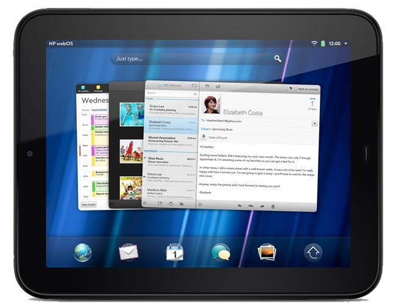
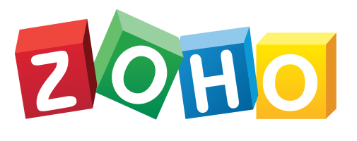
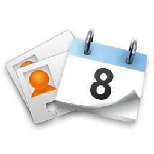

# Syncing Email, Calendars and Contacts

webOS has a first-class email client (arguably the best Exchange client for any Linux) that still works in some cases. Success is varied, depending on the server infrastructure.

> **Encryption note:** the connection tips below assume your device can already speak modern encryption. On **webOS 2.2.4 or 3.0.x**, that means you've run the [Modern TLS Updates](modern-tls.md) — with those in place, secure mail servers connect directly and you can ignore the OpenSSL-updater and proxy suggestions here. On [older devices](online.md), use the [OpenSSL updater](online.md#dealing-with-encryption) and/or a [proxy](proxysetup.md) as noted.

## Email

#### IMAP and POP mail

POP and IMAP servers still work, provided the server's encryption method is compatible with webOS. The [Modern TLS Updates](modern-tls.md) handle this on webOS 2.2.4 and 3.0.x; on [older devices](online.md), run the [OpenSSL Updater for webOS](http://www.webosarchive.org/activation/org.webosinternals.openssl-updater_0.9.8-6_armv7.ipk) to improve your odds of connecting.

#### Exchange Web Access

Private and hosted Exchange servers that provide EAS (Exchange Active Sync) can still be used. On webOS 2.2.4 and 3.0.x the [Modern TLS Updates](modern-tls.md) are enough; on [older devices](online.md), you'll need a [SSL-bump proxy](proxysetup.md) enabled.

#### Office365 (aka Microsoft365)

Microsoft has moved to "modern authentication," including an OAuth sign-in page that cannot be rendered on webOS devices. Attempts to request exceptions, even for paid accounts, have been met with hositility. As a work-around, <a href="https://davmail.sourceforge.net/" target="_blank">you can use DavMail on a PC or server to proxy access to your Office365 inbox using non-proprietary standards</a>.

#### Gmail

Gmail's built-in account type relies on Google's OAuth sign-in flow, which can't be rendered on webOS. The way around it is to add Gmail as a plain **IMAP** account using a <a href="https://myaccount.google.com/apppasswords" target="_blank">Google App Password</a> rather than your normal password. Generate one at <a href="https://myaccount.google.com/apppasswords" target="_blank">myaccount.google.com/apppasswords</a>, then enter it on the device in place of your password (App Passwords require 2-Step Verification to be enabled on your Google account).

That combination used to fail anyway, with a misleading "certificate is not trusted" message (error 4010) — webOS mis-verified Gmail's certificate, which uses an ECDSA key that the original mail stack doesn't handle. **This was fixed in 2026**: the [Modern TLS Updates](modern-tls.md) include a mail patch that resolves it, so Gmail IMAP signs in normally on webOS 2.2.4 and 3.0.x. If you're seeing error 4010, you're on an older version of the updates — run [Modern TLS Updates](modern-tls.md) again to pick up the current one.

Further background on <a href="https://forums.weboslives.eu/d/34-getting-gmail-working-in-2023/6" target="_blank">connecting webOS to Gmail is available in the webOS Lives Forums</a>.

#### Zoho

<a href="https://mail.zoho.com" target="_blank">Zoho</a> provides a cost-effective and full-featured alternative to Office365 and Google, with support for custom domains and Exchange ActiveSync. It works perfectly with webOS, with no hacks, work-arounds or modifications. If you have a choice in mail providers, webOS Archive highly recommends checking it out.

#### iCloud

You may be able to get IMAP access to your iCloud inbox. On webOS 2.2.4 and 3.0.x the [Modern TLS Updates](modern-tls.md) cover this; on [older devices](online.md), run the [OpenSSL Updater for webOS](http://www.webosarchive.org/activation/org.webosinternals.openssl-updater_0.9.8-6_armv7.ipk) first.

## Calendars and Contacts

The Calendar app on webOS is still one of the best out there -- particularly with the extra Touchpad screen real estate. As with email, service providers are continuing to lock down their environments in ways that webOS cannot support, but some of this can be resolved by leveraging web standards.

#### Exchange Web Access

As with mail, Private and hosted Exchange servers that provide EAS (Exchange Active Sync) can still be used — on webOS 2.2.4 and 3.0.x with the [Modern TLS Updates](modern-tls.md), or on [older devices](online.md) with a [SSL-bump proxy](proxysetup.md) enabled. Calendars and Contacts will sync seamlessly in a bi-directional fashion.

#### Zoho

<a href="https://calendar.zoho.com" target="_blank">Zoho</a> syncs via Exchange ActiveSync, and works without compromise on webOS.

#### Public Calendars

In 2026, support was added for syncing Public calendar URLs to TouchPad (and possibly Pre3) via a Synergy app called webCal Sync.

Most Cloud providers (including Google, iCloud, Office365/Outlook.com, and Canvas) supporting sharing via a URL. Although the method of sharing this URL differs between providers (some have a separate secret and public URL, some have limitations set by an administrator), if you can get a .ICS link out of your provider, that doesn't require authentication, you can do a one-way sync to get that calendar on to your device:

- Install <a href="https://appcatalog.webosarchive.org/app/webCalSync" target="_top">WebCal Sync</a> from the App Museum
- Create a placeholder account and calendar in the built-in Accounts app
- Use the WebCal Sync app to set the calendars you want to sync, one at a time with a test sync after each
- Calendars successfully added will automatically sync every 15 minutes if your device is online

If your Cloud service does not provide a method for publishing, but does work in Microsoft Outlook for Windows, you can use <a href="https://davmail.sourceforge.net/" target="_blank">DavMail</a> to publish calendar data to a service that does.

#### CalDav and CardDav

If you host your own Calendar and Contact data in a webDav-compatible service, like ownCloud or NextCloud, you can do a one-way or two-way sync with that service, using the C+Dav app.

C+Dav supports a wide variety of WebDav providers, and was updated in 2026.

- <a href="https://github.com/codepoet80/org.webosports.service.contacts.carddav/releases" target="_blank">Download the latest Release</a>

To learn more, <a href="https://webos-ports.org/wiki/C+_Dav_Synergy_Connector" target="_blank">visit the webOS Ports wiki</a>.