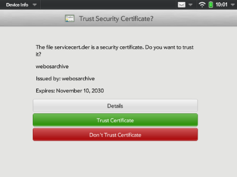

# Proxy Setup

Modern encryption isn't available on webOS mobile devices, and efforts to port it haven't panned out so far. Fortunately, on most webOS Devices, you can work-around by using a SSL-bump proxy. Outlined here are some options for proxies that can help you get your device online. Fair warning: SSL-bumping defeats the security of modern encryption, and shouldn't be used for anything highly private.

Unfortunately, the API to set a proxy wasn't added for most devices until webOS 2.2.4 (2.2.0 on Pre3). If you're on an original Pre or Pixi, you're out of luck. If you're on a Pre2 or Veer, it IS possible to update them to webOS 2.2.4, but depending on carrier, it requires some extra work to <a href="https://github.com/webos-internals/meta-doctor/" target="_blank">build and run a Super Doctor</a>. If you're on a Pre3 or TouchPad, you're ready to go.

**Important Note** Make sure the time on your device is at least close to accurate. Certificates are based on dates, so if your internal clock is wrong, you will get errors!

## Proxy Options

A few options are well tested, and work well on webOS 2.2.4 and higher. The choice is partially dictated by your device and home network environment.

### Self-Hosted Proxy

webOS Archive provides a free, easily installed self-hosting Squid Proxy that handles all the encryption issues for you. You'll need a computer that's always on to act as the proxy server. Linux and macOS are supported easily, Windows is supported through WSL (Windows Subsystem for Linux). This option also provides the ability to host the original Help content, restoring the on-device Help system.

Grab the latest release on the <a href="https://github.com/webOSArchive/squid-sslbump-for-webos/releases" target="_blank">webOS Archive GitHub</a> and <a href="https://github.com/webOSArchive/squid-sslbump-for-webos/blob/main/README.md" target="_blank">review the Readme</a> to get started running the server.

### On-Device Proxy

For Pre3 and TouchPad, you can run a proxy right on your device. <a href="https://gitlab.com/nizovn/com.nizovn.squid" target="_blank">Nizovn's Squid SSL Bump App</a> can be installed adding the modernization feed to Preware:

Add the following feed in the Preware "Manage Feeds" menu option, then "Update Feeds":
`http://stacks.webosarchive.org/feeds/modernize/ipkgs/`

Search for Squid and install it, and its dependencies. Once installed, you'll need to generate and install the certificate.

### WebOne Proxy

If the other two options are too complex for you, check out the WebOne proxy, which runs on Windows, Mac and Linux: <a href="https://github.com/atauenis/webone" target="_blank">WebOne on GitHub</a>

## Device Setup

Once you have a Proxy server running, you'll need to configure the device to use it. For most options, this involves two steps:

- Installing the proxy's certificate
- Configuring the proxy server

While the details will be slightly different, these steps are usually required.

### Easy Install

If you're using webOS 2.2.4 or higher, The easiest way to get started is with the NEW **webOS Archive Proxy** app.
To download, install [webOS App Museum II](appstores.md#install-webos-app-museum-ii) and search for "Proxy".

Or use the <a href="http://appcatalog.webosarchive.org/showMuseumDetails.php?app=1005768" target="_top">direct download</a> and install it yourself.

### Manual Configuration

If Easy Install doesn't work for you, or you still get certificate prompts, you can do all the steps manually. Make sure you start from a clean slate by removing any existing certs shown in the Certificate Manager app, and deleting downloaded certs from `/media/internal/`.

Also, it never hurts to do a full reboot between clean-up and manual install.

#### Adding the Certificate

Your proxy server provides a certificate you must install in order to bypass certificate warnings from other websites: one certificate that covers the whole Internet!

* On your computer, download the cert:
    + `http://<yourserverip>:3129/cert`
* Plug your webOS device into your computer with a USB cable, and enter USB Disk mode on the device
* Copy the cert you downloaded onto root directory of the USB device
* Launch the built-in webOS app "Device Info"
* From the menu in the top left corner, choose "Certificate Manager..."
* Press the "+" button at the bottom of the screen
* Select the new cert
* When prompted, choose the green button to "Trust" the cert
* Reboot your webOS device

#### Configure the Proxy

A Proxy switch app adds a feature to webOS allowing you to turn on (and off) a global proxy. Once activated, this proxy works for any app on the device -- including email!

* Install a Proxy app
    + Install the app **webOS Archive Proxy** app from App Museum II, or <a href="http://appcatalog.webosarchive.org/showMuseumDetails.php?app=1005768" target="_top">download directly here</a>.
    + Install the app **Proxy Set Basic** from Preware, or <a href="http://www.webosarchive.org/proxy/com.palm.com.verusora.touchpad.proxysetbasic_1.1.1_all.ipk" target="_top">download directly here</a>.
* Launch the app, and configure the fields as follows:
* Server: `<yourserverip>`
* Port: `3128`
* Press the "Set" button at the bottom

With your proxy configured, you should be able to open almost any modern webpage. But even with connectivity established, you may find that some web pages don't work well on your device -- the web has evolved since webOS was first born! 