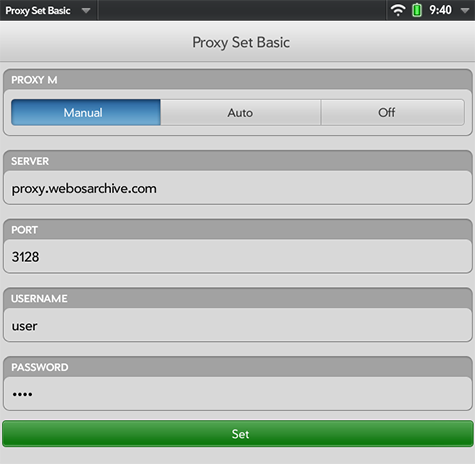

# Proxy Setup

Modern encryption isn't available on webOS mobile devices, and efforts to port it haven't panned out. Fortunately, on most webOS Devices, you can work-around by using a SSL-bump proxy. Outlined here are some options for proxies that can help you get your device online. Fair warning: SSL-bumping defeats the security of modern encryption, and shouldn't be used for anything highly private.

Unfortunately, the API to set a proxy wasn't added for most devices until webOS 2.2.4 (2.2.0 on Pre3). If you're on an original Pre or Pixi, you're out of luck. If you're on a Pre2 or Veer, it IS possible to update them to webOS 2.2.4, but depending on carrier, it requires some extra work to <a href="https://github.com/webos-internals/meta-doctor/" target="_blank">build and run a Super Doctor</a>. If you're on a Pre3 or TouchPad, you're ready to go.

## webOS Archive Proxy

The webOS Archive Proxy is a service offered to legacy webOS device users who agree to a convenant of behavior. It enables retro devices with older encryption libraries to browse the modern web by "bumping" the SSL encryption from the source. It is insecure by design, running on a shared resource, and should not be used for any purpose beyond the nostalgia and utility of a dead platform.

The provider of this Proxy makes no warranty of service level, security or privacy, and provides no indemnification for its users. In fact, the service keeps logs by default, which will be readily turned over to appropriate authorities upon request. Such logs include personal identifiable information, including the username and IP address of each user, as well as each web address they visit.

If you can live with these considerations, please visit this form to agree to the convenant and apply for an account:
[https://www.surveymonkey.com/r/8LW7M3B](https://www.surveymonkey.com/r/8LW7M3B)

Your credentials will be sent to you at the e-mail address you supplied, and can be used to set-up the Proxy on your webOS device.

If you'd rather not use a public proxy, see below for [alternate options](proxysetup.md#alternate-proxies).

### Prerequisites

This section assumes you've completed the previous steps to [get online](online.md), and [update the root certs](online.md#updating-certificates).

**Important Note** Make sure the time on your device is at least close to accurate. Certificates are based on dates, so if your internal clock is wrong, you will get errors!

### Easy Install

If you're using webOS 2.2.4 or higher, The easiest way to get started is with the NEW **webOS Archive Proxy** app.
To download, install [webOS App Museum II](appstores.md#install-webos-app-museum-ii) and search for "Proxy".

Or use the <a href="http://appcatalog.webosarchive.com/showMuseumDetails.php?app=1005768" target="_top">direct download</a> and install it yourself.

As well as letting you enable or disable the proxy, this app makes it easy to download the certificate and install it in the right place. Its a good idea to perform a full reboot after installing the certificate.

### Manual Configuration

If Easy Install doesn't work for you, or you still get certificate prompts, you can do all the steps manually. Make sure you start from a clean slate by removing any existing certs shown in the Certificate Manager app, and deleting downloaded certs from `/media/internal/`.

Also, it never hurts to do a full reboot between clean-up and manual install.

#### Adding the Certificate

The webOS Archive Certificate is a single certificate you must install in order to bypass certificate warnings from other websites: one certificate (or: cert) that covers the whole Internet.

* On your computer, download the cert:
    + <a href="http://www.webosarchive.com/proxy/wOSAServiceCert.der">http://www.webosarchive.com/proxy/wOSAServiceCert.der</a>
* Plug your webOS device into your computer with a USB cable, and enter USB Disk mode on the device
* Copy the cert you downloaded onto root directory of the USB device
* Launch the built-in webOS app "Device Info"
* From the menu in the top left corner, choose "Certificate Manager..."
* Press the "+" button at the bottom of the screen
* Select the new cert
* When prompted, choose the green button to "Trust" the cert
* Reboot your webOS device

#### Configure the Proxy

A Proxy switch app adds a feature to webOS allowing you to turn on (and off) a global proxy. Once activated, this proxy works for any app on the device -- including email!

* Install a Proxy app
    + Install the app **webOS Archive Proxy** app from App Museum II, or <a href="http://appcatalog.webosarchive.com/showMuseumDetails.php?app=1005768" target="_top">download directly here</a>.
    + Install the app **Proxy Set Basic** from Preware, or <a href="http://www.webosarchive.com/proxy/com.palm.com.verusora.touchpad.proxysetbasic_1.1.1_all.ipk" target="_top">download directly here</a>.
* Launch the app, and configure the fields as follows:
* Server: `proxy.webosarchive.com`
* Port: `3128`
* Username: `<yourusername>`
* Password: `<yourpassword>`
* Press the "Set" button at the bottom

Make sure you substitute your actual username and password as given to you during your initial registration in the fields above.

When done, your screen should look like this:

With your proxy configured, you should be able to open almost any modern webpage. But even with connectivity established, you may find that some web pages don't work well on your device -- the web has evolved since webOS was first born! 

You may want to consider using a RSS Service, and an app like <a href="http://www.feedspider.net/" target="_blank">FeedSpider</a> (available in Preware, and in App Museum II) to pull feeds from your favorite sites.

## Alternate Proxies

If you prefer not to, or are unable to, use a public service, you can also run a proxy right on your webOS Device:

* <a href="https://forums.webosnation.com/webos-apps-games/332506-squid-ssl-bump.html" target="_blank">Nizovn's Squid SSL Bump App</a>

Another option is to host the Service yourself. If you have a Raspberry Pi (also works on Ubuntu), this can be done really easily:

* <a href="https://github.com/codepoet80/squid-sslbump-rpi" target="_blank">Squid SSL Bump Installer</a>