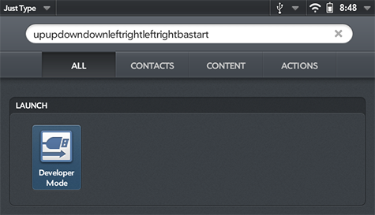

# Writing Apps for webOS

webOS is a combination of Linux and Javascript technologies, that provide incredible power and flexibility, while remaining remarkably easy to to learn. If you are new to software development, or if you've been doing it for awhile, you'll find the restored SDK and PDK to be a tremendous asset.

## Activate Developer Mode

#### webOS 1.0

* From the Launcher, start typing: `webos20090606`

* Tap the "Developer Mode" icon that appears in the search results, and turn it On.

#### webOS 2.0

* Use the built-in "Just Type" search feature on the Launcher, and type: `upupdowndownleftrightleftrightbastart`

* Tap the "Developer Mode" icon that appears in the search results, and turn it On.

## SDK

The SDK refers to apps built in Javascript frameworks. On the front-end (the part you see) both older and newer webOS Devices support a framework called Mojo. Later, HP introduced a framework called Enyo. On the back-end, services could use NodeJS and access some platform capabilities through services known as Luna.

## PDK

The PDK refers to C and C++ binaries that had more direct access to the underlying hardware and platform. This was commonly used in games or some media players that needed high performance graphics.

## Getting Started

<a href="http://www.webosarchive.com" target="_top">webOS Archive</a> has restored key portions of the SDK/PDK almost entirely, including the online documentation, emulators, and other tools you'll need to get started.

Visit <a href="http://sdk.webosarchive.com/docs/docs.html#dev-guide/tools.html" target="_top">http://sdk.webosarchive.com</a> to get access now!

## Other Documentation

In 2009, O'Reilly Press released a book on Mojo development called "Palm webOS: The Insider's Guide to Developing Applications in Javascript using the Palm Mojo Framework."

The book is available on [Google Books](https://books.google.com/books?id=sHT6PeMp1k8C&printsec=frontcover) in its entirety, and on Amazon and most online bookstores in paperback.

Tuts+ still hosts a 5-part [Introduction to webOS Development](https://code.tutsplus.com/series/introduction-to-webos-sdk-development--mobile-22879) series, focused on Mojo development on the Pre. It remains a worthwhile resource for new developers.