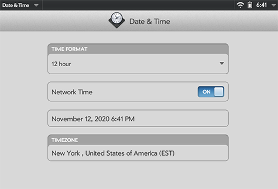
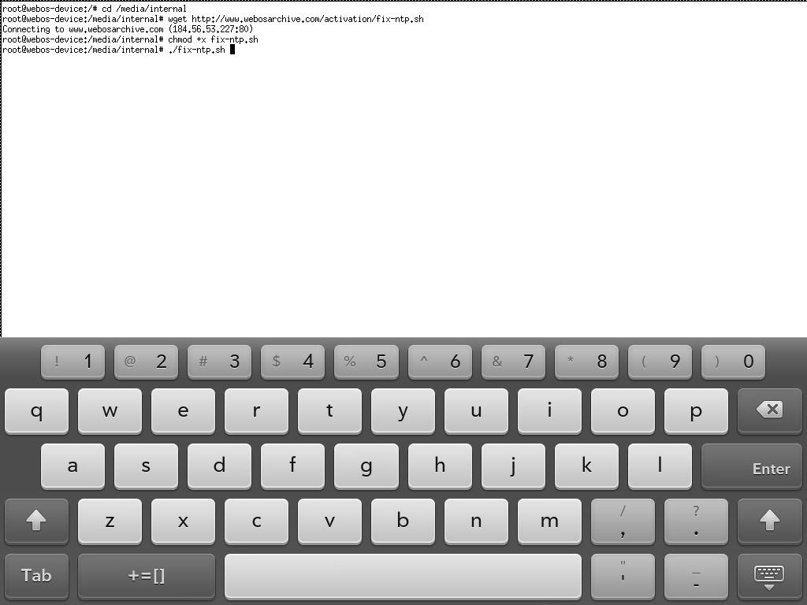

# Time Synchronization

Your webOS Device is built to synchronize its time with long-dead servers, and you will find that the internal clock begins to drift. Usually this drift isn't enough to cause significant problems, but it can be annoying -- and most of the time, its easy to fix!

## TouchPad or TouchPad Go

In 2018, the community figured out how to solve the time sync problem permanently on TouchPad; webOS Nation member dkirker [built a script to make it easy](https://forums.webosnation.com/hp-touchpad/331734-network-time-not-keeping-clocks-accurate-2.html). The script has been renamed to make it easier to type on your device, but it is otherwise unchanged.

These instructions assume that you've completed the [Shell Access](bash.md) steps, and are comfortable entering a few instructions into the command line.

### Set Date and Time
* Launch the built-in "Date & Time" app
* Set the date and time to close to reality
* Set your Timezone
* Turn on Network Time

### Run the Fix Script

* Launch Xecutah and click the "Start XTerm" button
* If you're on a TouchPad, tap on the screen with 3 fingers to open the keyboard
* Enter these commands:
    + `wget http://www.webosarchive.com/activation/fix-ntp.sh`
    + `chmod +x fix-ntp.sh`
    + `./fix-ntp.sh`
* When the script completes, the device will restart and the device will keep time properly.

## Phones

The script above has not been shown to work well on phones, and in some cases, seems to make the problem worse. Generally phones do OK keeping time as long as they have battery power, but may need to be set manually after being off or with a dead battery. Two potential work-arounds may help:

### Carrier Time

Phones will, by default, get time from a cellular network carrier -- at least until the 3G shut down. If you have a Verizon device, your device doesn't use a SIM card, you're always connected, and as long as your time zone is set correctly, the clock should update.

For other devices, the only way to get time from a carrier is to install a SIM card.

### Clock Sync

Some users have had success using the Clock Sync app available in the App Museum. It can be configured to sync time in the background on a set schedule.

* Download [Clock Sync](http://appcatalog.webosarchive.com/showMuseumDetails.php?search=clock+sync&app=1819)
