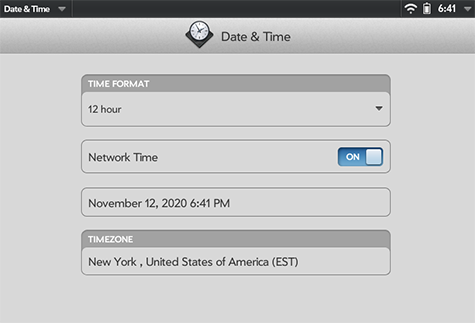
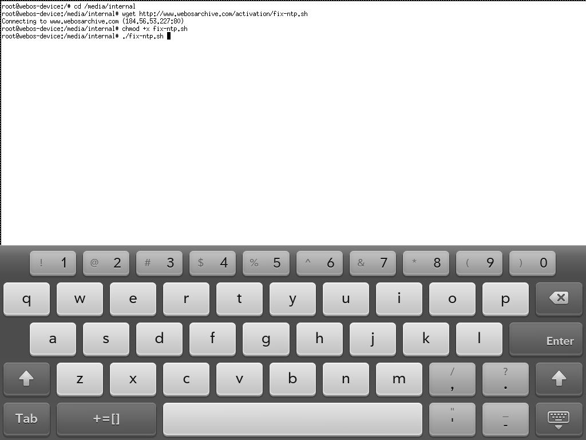

# Time Synchronization

Your webOS Device is built to synchronize its time with long-dead servers, and you will find that the internal clock begins to drift. Usually this drift isn't enough to cause significant problems, but it can be annoying -- and most of the time, its easy to fix!

> **If you've run the [Modern TLS Updates](modern-tls.md), this is already done.** Both bundles — tablet and phone — install an automatic time sync that points the device at a working NTP server, so the clock stays right on its own. There's nothing else to set up, and you can skip the rest of this page. (Correct time matters for more than convenience: TLS certificates are validated against the clock, which is why it ships as part of the updates.)

The sections below are for devices that aren't running the TLS Updates.

### Clock Sync

The simplest solution is the Clock Sync app available in the App Museum. It can be configured to sync time in the background on a set schedule, and runs on all devices. In 2022, it was updated to resolve issues where the host could not be contacted over HTTP.

* <a href="https://appcatalog.webosarchive.org/app/ClockSync" target="_top">Download Clock Sync</a>

## TouchPad or TouchPad Go — Manual Fix Script

*This is the older, do-it-yourself version of what the [Modern TLS Updates](modern-tls.md) now install for you. Use it only if you're not running those.*

In 2018, the community figured out how to solve the time sync problem permanently on TouchPad; webOS Nation member dkirker <a href="http://stacks.webosarchive.org/forums/Network%20Time%20not%20keeping%20clocks%20accurate%20-%20Page%202%20-%20webOS%20Nation%20Forums_files/" target="_blank">built a script to make it easy</a>. The script has been renamed to make it easier to type on your device, but it is otherwise unchanged.

These instructions assume that you've completed the [Shell Access](bash.md) steps, and are comfortable entering a few instructions into the command line.

### Set Date and Time
* Launch the built-in "Date & Time" app
* Set the date and time to close to reality
* Set your Timezone
* Turn on Network Time

### Run the Fix Script

* Launch Xecutah and click the "Start XTerm" button
* If you're on a TouchPad, tap on the screen with 3 fingers to open the keyboard
* Enter these commands:
    + `wget http://www.webosarchive.org/activation/fix-ntp.sh`
    + `chmod +x fix-ntp.sh`
    + `./fix-ntp.sh`
* When the script completes, the device will restart and the device will keep time properly.

## Phones

Due to the 2G and 3G shut down, happening at different times around the world, phones that used to sync time with a cellular network carrier, have started drifting.

On **webOS 2.2.4** (Pre3, and an upgraded Veer or Pre 2), the [Modern TLS Updates](modern-tls.md) fix this for you — the phone bundle installs the same automatic time sync the tablet one does. That's the recommended answer.

The old tablet fix script has never worked well on phones, and in most cases seems to make the problem worse — don't use it there. On phones that can't run the TLS Updates, the Clock Sync app mentioned above works well.