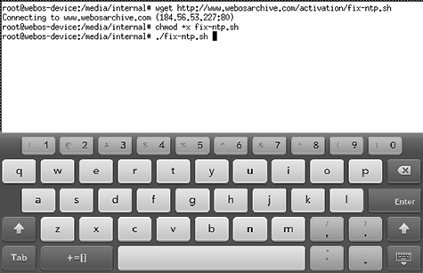

# Time Synchronization

Your webOS Device is built to synchronize its time with long-dead servers, and you will find that the internal clock begins to drift. Usually this drift isn't enough to cause significant problems, but it can be annoying -- and fortunately, its easy to fix!

In 2018, the community figured out how to solve this permanently; webOS Nation member dkirker [built a script to make it easy](https://forums.webosnation.com/hp-touchpad/331734-network-time-not-keeping-clocks-accurate-2.html). The script has been renamed to make it easier to type on your device, but it is otherwise unchanged.

These instructions assume that you've completed the [Shell Access](bash.md) steps, and are comfortable entering a few instructions into the command line.

## Set Date and Time
* Launch the built-in "Date & Time" app
* Set the date and time to close to reality
* Set your Timezone
* Turn on Network Time

## Run the Fix Script

* Launch Xecutah and click the "Start XTerm" button
* If you're on a TouchPad, tap on the screen with 3 fingers to open the keyboard
* Enter these commands:
    + `cd /media/internal`
    + `wget http://www.webosarchive.com/activation/fix-ntp.sh`
    + `chmod +x fix-ntp.sh`
    + `./fix-ntp.sh`
* When the script completes, the device will restart and the device will keep time properly.

